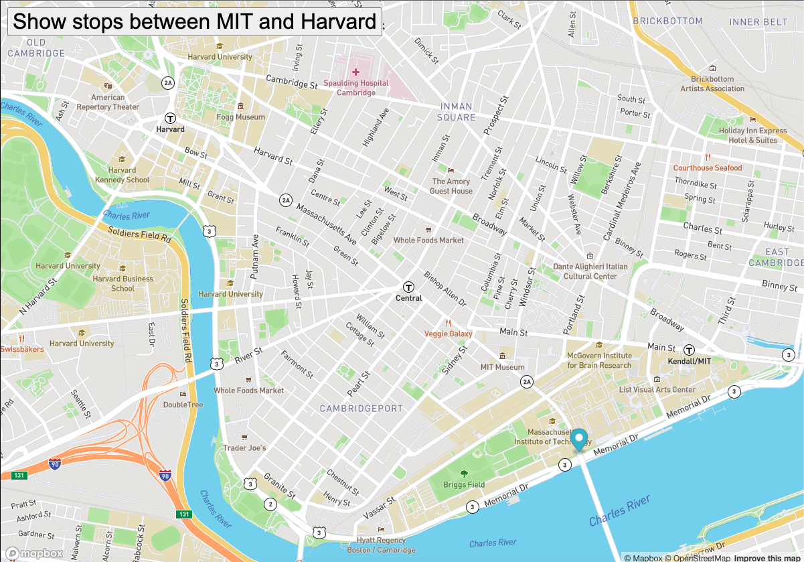

# Real Time Bus Tracker 

# Description
This is my MIT coursework project, that tracks the current location of MBTA BUS Route 1 between MIT and Harvard campus using mapbox as the mapping platform and accessing live bus gps information from the MBTA API. The MBTA bus data is used to determine stops between MIT and Harvard with an animated marker on the map to highlight the bus routes and displays live locations of the busses on a map.

# How to Run
Try it out live at https://github.com/ggmziray/Real-TimeBusTracker

# Roadmap of Future Improvements
1.) Customization
2.) Adding more locations & markers
3.) Improving functionality 
4.) Creating a visual bus schedule & alerts for when a bus is coming

# License

MIT License
Copyright (c) 2022 Gilléad-Gary Mziray

Permission is hereby granted, free of charge, to any person obtaining a copy of this software and associated documentation files (the "Software"), to deal in the Software without restriction, including without limitation the rights to use, copy, modify, merge, publish, distribute, sublicense, and/or sell copies of the Software, and to permit persons to whom the Software is furnished to do so, subject to the following conditions:

The above copyright notice and this permission notice shall be included in all copies or substantial portions of the Software.

THE SOFTWARE IS PROVIDED "AS IS", WITHOUT WARRANTY OF ANY KIND, EXPRESS OR IMPLIED, INCLUDING BUT NOT LIMITED TO THE WARRANTIES OF MERCHANTABILITY, FITNESS FOR A PARTICULAR PURPOSE AND NONINFRINGEMENT. IN NO EVENT SHALL THE AUTHORS OR COPYRIGHT HOLDERS BE LIABLE FOR ANY CLAIM, DAMAGES OR OTHER LIABILITY, WHETHER IN AN ACTION OF CONTRACT, TORT OR OTHERWISE, ARISING FROM, OUT OF OR IN CONNECTION WITH THE SOFTWARE OR THE USE OR OTHER DEALINGS IN THE SOFTWARE.
